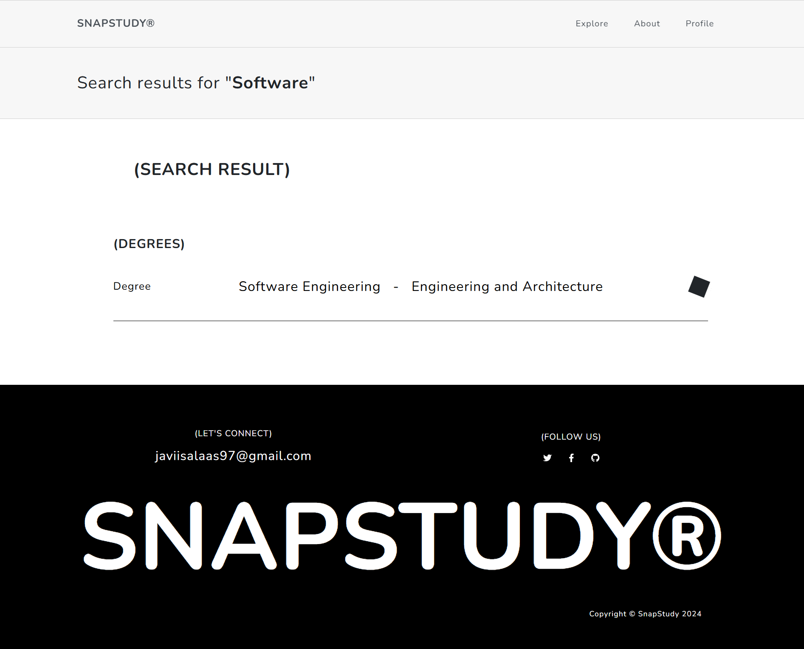

# SnapStudy

## Alumno: Javier Rodríguez Salas
## Tutor: Micael Gallego

## [Enlace al blog](https://medium.com/@javiisalaas97)

## [Enlace a GitHub Project](https://github.com/orgs/codeurjc-students/projects/8)

## [Funcionalidades de la aplicación](https://medium.com/@javiisalaas97/funcionalidades-de-snapstudy-65b5d5421d41)

## [Aspectos principales de la aplicación web](https://medium.com/@javiisalaas97/aspectos-principales-de-snapstudy-2b9f56dfd1bd)

## [Crear credenciales para Google Drive](https://medium.com/@javiisalaas97/creaci%C3%B3n-de-credenciales-para-google-drive-api-c92acd46848c)

## Wireframe de pantallas y navegación


## Fase 1

### Pantallas

#### Página principal
Una landing page donde puedes usar un buscador, ver los grados disponibles o acceder a información de SnapStudy.


#### Inicio de sesión
En esta pantalla podrás acceder a tu cuenta.


#### Registro
En esta pantalla podrás crear una nueva cuenta.


#### About
En esta página encontrarás información sobre la funcionalidad y objetivo de SnapStudy, además de conocer la tecnología con la que trabaja.


#### Explore
Representa el mismo listado de grados incluido en la página principal.


#### Lista de asignaturas
Muestra un listado de las asignaturas de un grado.


#### Listado de documentos
Representa el listado de recursos disponibles para una asignatura.


#### Búsqueda
Muestra todas las coincidencias encontradas a la hora de realizar una búsqueda.



#### Panel principal de administrador
Listado de grados con opciones de borrado y creación de nuevos.


#### Listado de asignaturas (administrador)
Listado de asignaturas con opciones de borrado y creación de nuevas.


#### Listado de documentos (administrador)
Listado de recursos disponibles para una asignatura con opciones para añadir nuevos, previsualizar o eliminar existentes.


#### Añadir recurso (administrador)
Popup que permite subir un nuevo recurso a una asignatura.


#### Añadir asignatura (administrador)
Panel que permite al administrador crear una nueva asignatura.


#### Añadir grado (administrador)
Panel que permite al administrador crear un nuevo grado.


#### Listado de documentos (usuario registrado)
Listado de documentos de una asignatura, donde se permite descargar y previsualizar estos.


#### Perfil (usuario registrado)
Información principal del usuario, donde puedes modificar esta información o añadir una foto de perfil.


#### Añadir imagen de perfil (usuario registrado)
Popup que permite subir una nueva imagen de perfil.


### Diagrama de navegación


### Diagrama de entidades de base de datos


### Diagrama de clases backend


### Diagrama de clases frontend SPA


### Construcción de la imagen Docker

Para construir la imagen docker de SnapStudy debemos seguir los siguientes pasos:

1. Clonar el repositorio
```
https://github.com/codeurjc-students/2024-snap-study.git
```

2. Navegar hasta el directorio "docker" dentro del proyecto
```
cd 2024-snap-study/docker
```

3. Instalar docker en nuestro sistema [here](https://docs.docker.com/engine/install/)

4. Busca docker y ejecútalo

5. Haz login en tu cuenta de Docker
```
docker login
```

7. Para generar la imagen Docker, ejecuta
```
./create_image.sh
```

Este script contiene los siguientes comandos
```
# Establece el contexto de compilación para el padre y compila usando Dockerfile desde el directorio de Docker
docker build -t jrodriguezs2020/snapstudy -f docker/Dockerfile .
# Sube la imagen a DockerHub
docker push jrodriguezs2020/snapstudy
# Ejecuta la imagen usando docker-compose desde el directorio de Docker
docker-compose up
```

### Instrucciones de ejecución de la aplicación dockerizada

1. Clonar el repositorio
```
https://github.com/codeurjc-students/2024-snap-study.git
```

2. Instalar docker en nuestro sistema [here](https://docs.docker.com/engine/install/)

3. Busca docker y ejecútalo

4. SnapStudy cuenta con una versión simplificada de la aplicación que no dispone de todos los servicios cloud que usa la aplicación, pero tiene todas las funcionalidades básicas. Esta es la [versión 1.0.0](https://github.com/codeurjc-students/2024-snap-study/releases/tag/v1.0.0) Podemos elegir entre usar el servicio de AWS S3 para el almacenamiento de los archivos o MinIO en local.
Para usar AWS S3 es necesario tener una cuenta AWS y configurar un bucket de S3. Únicamente necesitamos sustituir los campos change-me en el archivo docker-compose.yml, en este caso AWS_ACCESS_KEY_ID y AWS_SECRET_ACCESS_KEY que se corresponden con el Access Key y Secrect Key de la cuenta AWS.

Si deseamos usar MinIO, y no vamos a ejecutar la aplicación web con docker-compose, debemos tener instalado en nuestro sistema este recurso [instalación](https://min.io/docs/minio/windows/operations/installation.html). Una vez instalado abrimos una consola de comandos y debemos navegar hasta la ruta donde se encuentre el archivo minio.exe y, una vez en la ruta, debemos ejecutar el siguiente comando
```
minio.exe server D:/minio --console-address ":9001"
```
De esta forma tendremos un sistema de almacenamiento en local que simula a AWS S3.

Ten en cuenta que si decides usar MinIO con docker-compose debes ajustar las rutas a la IP del contenedor docker que se cree, además de iniciar MinIO con docker, aquí te dejo un ejemplo
```
version: "3.9"
services:
  web:  
    image: jrodriguezs2020/snapstudy
    ports:
      - "8443:8443"
    environment:
      - SPRING_DATASOURCE_URL=jdbc:mysql://db:3306/snapstudy
      - SPRING_DATASOURCE_USERNAME=root
      - SPRING_DATASOURCE_PASSWORD=DAWWebapp09+
    depends_on:
      - db
      - minio
    restart: on-failure

  db:
    image: mysql:8.0.22
    restart: always
    ports:
      - "3307:3306"
    environment:
      - MYSQL_DATABASE=snapstudy
      - MYSQL_ROOT_PASSWORD=DAWWebapp09+
    volumes:
      - mysql:/var/lib/mysql

  minio:
    image: minio/minio:latest
    ports:
      - "9000:9000"
    environment:
      - MINIO_ROOT_USER=minioadmin
      - MINIO_ROOT_PASSWORD=minioadmin
    command: server /data
    volumes:
      - minio_data:/data
    restart: always

volumes:
  mysql:
  minio_data:
```

Podemos conocer la IP de nuestro contenedor docker así
```
docker inspect -f '{{range .NetworkSettings.Networks}}{{.IPAddress}}{{end}}' docker-minio-1
```

Además debemos modificar el valor de la variable useMinIO de S3Service.java a true:
```
private static final boolean useMinIO = true;
```

5. Si deseas lanzar Snapstudy al completo, con todas sus funcionalidades y los servicios cloud que usa debes seguir la [Guía para desplegar la infraestructura cloud de SnapStudy]()

6. Una vez creada la infraestructura cloud, para que el backend de nuestra aplicación pueda hacer uso de los servicios de AWS debemos tener las credenciales de la cuenta de AWS a mano. Para ello planteo 2 opciones:
   1. Modificar las siguientes variables de entorno con los valores proporcionados al crear nuestra cuenta y usuario de AWS:
   ```
   - AWS_ACCESS_KEY_ID=change_me
   - AWS_SECRET_ACCESS_KEY=change_me
   ```

   2. Añadir al template docker-compose.yml la siguiente variable de entorno y el siguiente volumen. Se deben añadir en las secciones 'environment' y 'volumes' ya existentes:
   ```
   environment:
     - AWS_PROFILE=change_me
  volumes:
     - ~/.aws:/root/.aws
   ```

7. Para que la aplicación use AWS RDS, tenemos que sustituir en el archivo docker-compose.yml las siguientes variables:
```
- DB_URL=change_me
- DB_USER=change_me
- DB_PASSWORD=change_me
```
Además debemos importar a la base de datos el archivo backup.sql que encontramos en el repositorio. Este archivo contiene datos básicos de ejemplo para un primer arranque de la aplicación. Para subir el archivo a RDS ejecutamos el siguiente comando:
```
mysql -h tu_endpoint_rds.amazonaws.com -u tu_usuario -p < backup.sql
```
En el caso en el que no deseemos usar RDS y queramos tener la base de datos en local, debemos mantener las anteriores variables mencionadas como:
```
- DB_URL=jdbc:mysql://localhost:3306/snapstudy
- DB_USER=root
- DB_PASSWORD=DAWWebapp09+
```

8. Otra modificación que debemos hacer es añadir el endpoint que se ha creado con nuestra instancia de opensearch:
```
- AWS_OPENSEARCH_ENDPOINT=change_me
```

9. Para poder usar el servicio de Google Drive integrado en SnapStudy, debemos cargar el archivo "credentials.json", el cual contendrá las credenciales para poder usar el cliente de Google Drive para el volcado de documentos a Drive. Para hacernos con este archivo de credenciales podemos seguir el siguente [post](https://medium.com/@javiisalaas97/creaci%C3%B3n-de-credenciales-para-google-drive-api-c92acd46848c)
Otro paso importante para poder usar correctamente el servicio de Google Drive es generar una contraseña de aplicación. Puedes seguir los pasos en el siguiente [post]()
Además, en el archivo docker-compose.yaml debemos asignar el valor correspondiente a las siguientes variables de entorno:
```
- GOOGLE_DRIVE_FOLDER=change_me #En tu unidad de Google Drive deberás crear una carpeta donde se van a almacenar todas las carpetas de los usuarios de SnapStudy (https://drive.google.com/drive/u/3/folders/{ID})
- APPLICATION_MAIL=change_me #Email desde el cual se va a gestionar Google Drive y el que hemos usado para generar las credenciales
- APPLICATION_PASS_MAIL=change_me #Contraseña de aplicación
- CREDENTIALS_FILE_PATH=change_me #Path dónde coloques el archivo de credenciales
```

10. Navegar hasta el directorio "docker" dentro del proyecto
```
cd 2024-snap-study/docker
```

11. Ejecuta el comando
```
docker-compose up
```

12. Una vez finalizado el paso anterior, abre un navegador y busca [https://localhost:8443](https://localhost:8443)