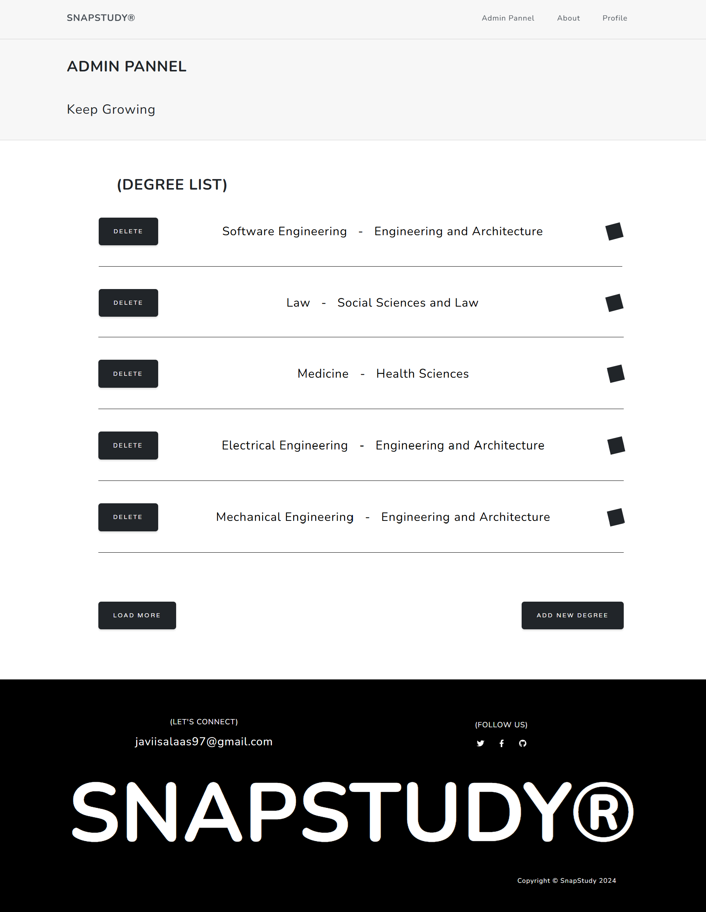
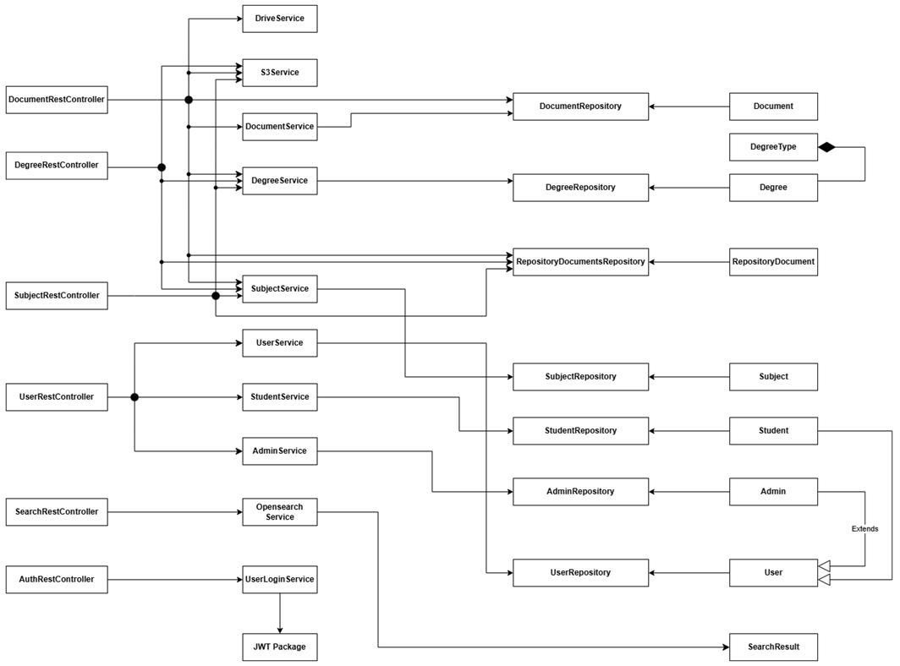
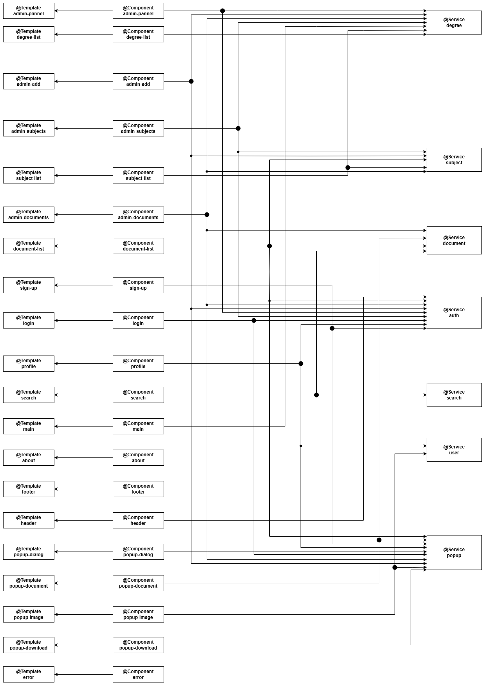

# SnapStudy

## Alumno: Javier Rodríguez Salas
## Tutor: Micael Gallego

## [Enlace al blog](https://medium.com/@javiisalaas97)

## [Enlace a GitHub Project](https://github.com/orgs/codeurjc-students/projects/8)

## [Funcionalidades de la aplicación](https://medium.com/@javiisalaas97/funcionalidades-de-snapstudy-65b5d5421d41)

## [Aspectos principales de la aplicación web](https://medium.com/@javiisalaas97/aspectos-principales-de-snapstudy-2b9f56dfd1bd)

## [Crear credenciales para Google Drive](https://medium.com/@javiisalaas97/creaci%C3%B3n-de-credenciales-para-google-drive-api-c92acd46848c)

## [Cómo generar una contraseña de aplicación en Gmail](https://medium.com/@javiisalaas97/c%C3%B3mo-generar-una-contrase%C3%B1a-de-aplicaci%C3%B3n-en-gmail-03b11055f5bd)

## Wireframe de pantallas y navegación


## Fase 1

### Pantallas

#### Página principal
Una landing page donde puedes usar un buscador, ver los grados disponibles o acceder a información de SnapStudy.


#### Inicio de sesión
En esta pantalla podrás acceder a tu cuenta.


#### Registro
En esta pantalla podrás crear una nueva cuenta.


#### About
En esta página encontrarás información sobre la funcionalidad y objetivo de SnapStudy, además de conocer la tecnología con la que trabaja.


#### Explore
Representa el mismo listado de grados incluido en la página principal.


#### Lista de asignaturas
Muestra un listado de las asignaturas de un grado.


#### Listado de documentos
Representa el listado de recursos disponibles para una asignatura.


#### Búsqueda
Muestra todas las coincidencias encontradas a la hora de realizar una búsqueda.


#### Panel principal de administrador
Listado de grados con opciones de borrado y creación de nuevos.



#### Listado de asignaturas (administrador)
Listado de asignaturas con opciones de borrado y creación de nuevas.


#### Listado de documentos (administrador)
Listado de recursos disponibles para una asignatura con opciones para añadir nuevos, previsualizar o eliminar existentes.


#### Añadir recurso (administrador)
Popup que permite subir un nuevo recurso a una asignatura.


#### Añadir asignatura (administrador)
Panel que permite al administrador crear una nueva asignatura.


#### Añadir grado (administrador)
Panel que permite al administrador crear un nuevo grado.


#### Listado de documentos (usuario registrado)
Listado de documentos de una asignatura, donde se permite descargar y previsualizar estos.


#### Perfil (usuario registrado)
Información principal del usuario, donde puedes modificar esta información o añadir una foto de perfil.


#### Añadir imagen de perfil (usuario registrado)
Popup que permite subir una nueva imagen de perfil.


### Diagrama de navegación


### Diagrama de entidades de base de datos


### Diagrama de clases backend



### Diagrama de clases frontend SPA



### Diagrama de flujo de la arquitectura Cloud


### Construcción de la imagen Docker

Para construir la imagen docker de SnapStudy debemos seguir los siguientes pasos:

1. Clonar el repositorio
```
https://github.com/codeurjc-students/2024-snap-study.git
```

2. Navegar hasta el directorio "docker" dentro del proyecto
```
cd 2024-snap-study/docker
```

3. Instalar docker en nuestro sistema [here](https://docs.docker.com/engine/install/)

4. Busca docker y ejecútalo

5. Haz login en tu cuenta de Docker
```
docker login
```

7. Para generar la imagen Docker, ejecuta
```
./create_image.sh
```

Este script contiene los siguientes comandos
```
# Establece el contexto de compilación para el padre y compila usando Dockerfile desde el directorio de Docker
docker build -t jrodriguezs2020/snapstudy -f docker/Dockerfile .
# Sube la imagen a DockerHub
docker push jrodriguezs2020/snapstudy
# Ejecuta la imagen usando docker-compose desde el directorio de Docker
docker-compose up
```

### Instrucciones de ejecución de la aplicación dockerizada

1. Clonar el repositorio
```
https://github.com/codeurjc-students/2024-snap-study.git
```

2. Instalar docker en nuestro sistema [here](https://docs.docker.com/engine/install/)

3. Busca docker y ejecútalo

4. Previo al despliegue del primer stack, donde se crea la función Lambda, es necesario subir el código de esta en formato .zip a un bucket de S3. Para llevar a cabo este paso, primero debemos descargar el código implementado para esta función, el cual se encuentra en el repositorio SnapStudy-text-process-lambda. Una vez clonado el repositorio, se debe navegar al directorio correspondiente y ejecutar los siguientes comandos para preparar y empaquetar la función Lambda:
```
venv\Scripts\activate
mkdir lambda_function
cp lambda_code.py .\lambda_function\
pip install PyPDF2 -t .\lambda_function\
pip install typing_extensions -t .\lambda_function\
pip install opensearch-py requests-aws4auth -t .\lambda_function\
pip install pymysql -t .\lambda_function\
cd .\lambda_function\
zip -r ../lambda_code.zip .
```

Este ZIP generado debe alojarse en un bucket de S3 llamado snapstudy-artifacts.

5. Para lanzar Snapstudy al completo, con todas sus funcionalidades y los servicios cloud que usa debes desplegar los templates de cloudformation infra.yaml y opensearch.yaml, este orden. Además, una vez creado el dominio de opensearch, tenemos que crear el índice donde indexaremos los documentos:
```
awscurl -X PUT --service es --region eu-west-1 -H "Content-Type: application/json" -d "{\"settings\": {\"number_of_shards\": 1, \"number_of_replicas\": 1}}" <domain_endpoint>/snapstudy-index
```

6. Para poder usar el servicio de Google Drive integrado en SnapStudy, debemos cargar el archivo "credentials.json", el cual contendrá las credenciales para poder usar el cliente de Google Drive para el volcado de documentos a Drive. Para hacernos con este archivo de credenciales podemos seguir el siguente [post](https://medium.com/@javiisalaas97/creaci%C3%B3n-de-credenciales-para-google-drive-api-c92acd46848c)
Otro paso importante para poder usar correctamente el servicio de Google Drive es generar una contraseña de aplicación. Puedes seguir los pasos en el siguiente [post](https://medium.com/@javiisalaas97/c%C3%B3mo-generar-una-contrase%C3%B1a-de-aplicaci%C3%B3n-en-gmail-03b11055f5bd)

7. 
El despliegue de la aplicación en una instancia de AWS EC2 se realiza a través del template de CloudFormation ec2.yaml. Esta plantilla crea una instancia EC2 basada en una AMI de Amazon Linux 2023. La plantilla configura automáticamente el entorno necesario para arrancar la aplicación, pero requiere que el archivo de credenciales de Google Drive se añaada manualmente a un bucket de S3. Una vez completado el despliegue del stack, tras unos minutos, se podrá acceder a SnapStudy mediante la dirección IP pública de la instancia EC2, a través del puerto 8443.
```
https://<IP_PUBLICA_EC2>:
```